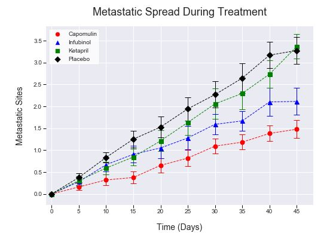

# Sample cancer pharmaceutical drug trial analysis
Data analysis of effects of 3 drugs + placebo over the course of 45 day clinical trial period.

**Technologies used**
- Python
- Pandas
- Matplotlib
- Statistics

